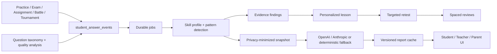

# IlmLiga Learning Diagnostics — Yakuniy texnik topshiruv

Holat: implementation va lokal verifikatsiya yakunlangan

Hujjat versiyasi: 1.0

Sana: 2026-08-07

## 1. Arxitektura xulosasi

Learning Diagnostics o‘quvchining barcha qo‘llab-quvvatlangan faoliyatlaridagi javoblarini yagona `student_answer_events` oqimiga olib keladi. Savol taksonomiyasi va AI tahlili javobni mavzu, ko‘nikma, xato turi va sifat signallari bilan boyitadi. Asinxron worker o‘quvchining skill profilini, dalil holatini, mastery, confidence va priority qiymatlarini qayta hisoblaydi. Pattern detector takroriy xato, noto‘g‘ri tushuncha, vaqt bosimi, regressiya va prerequisite bo‘shliqlarini aniqlaydi.

Tasdiqlangan finding uchun shaxsiy dars, mashqlar, targeted retest va spaced review yaratiladi. Student, teacher va parent hisobotlari shaxsiy ma’lumotlari minimallashtirilgan snapshotdan olinadi; AI provayder ishlamasa ham aynan shu real snapshotdan deterministik fallback hisobot qaytadi. Progress UI faqat ilmiy foydali o‘quv ko‘rsatkichlarini, mavzulashtirilgan xatolarni, darslarni va review rejasini ko‘rsatadi.



## 2. O‘zgartirilgan fayllar

Quyidagi tracked fayllar joriy diagnostics implementatsiyasida o‘zgartirilgan:

- `.env.example`
- `aiService.js`
- `aiSnapshot.js`
- `package.json`
- `public/admin.html`
- `public/practice.html`
- `public/progress.html`
- `public/progress.js`
- `public/teacher-results.html`
- `server.js`
- `src/controllers/adminQuestionBulkImportController.js`
- `src/controllers/adminQuestionCreateController.js`
- `src/controllers/adminQuestionHealthController.js`
- `src/controllers/adminQuestionListController.js`
- `src/controllers/adminQuestionUpdateController.js`
- `src/controllers/parentWeeklyAiReportController.js`
- `src/controllers/practiceController.js`
- `src/controllers/studentExamAttemptAnswerController.js`
- `src/controllers/studentWeeklyAiReportController.js`
- `src/controllers/teacherWeeklyAiReportController.js`
- `src/routes/adminQuestionUpdateRoutes.js`
- `src/routes/studentWeeklyAiReportRoutes.js`
- `src/services/adminQuestionBulkImportService.js`
- `src/services/examAttemptGradingService.js`
- `src/services/examSubmitService.js`
- `src/services/notificationService.js`
- `src/services/studentAssignmentSubmitService.js`
- `src/services/studentExamAttemptAnswerService.js`
- `src/services/teacherResultsAnalyticsService.js`
- `src/services/tournamentMatchAnswerService.js`
- `src/sockets/battleAnswerSocket.js`
- `src/sockets/teamBattleAnswerSocket.js`
- `tests/admin-question-bulk-import.test.js`
- `tests/admin-question-create.test.js`
- `tests/admin-question-health.test.js`
- `tests/admin-question-list.test.js`
- `tests/admin-question-update.test.js`
- `tests/battle-answer-socket.test.js`
- `tests/exam-attempt-grading-service.test.js`
- `tests/exam-submit.test.js`
- `tests/parent-weekly-ai-report.test.js`
- `tests/practice.test.js`
- `tests/progress-page.test.js`
- `tests/student-assignment-submit.test.js`
- `tests/student-exam-attempt-answer.test.js`
- `tests/student-weekly-ai-report.test.js`
- `tests/teacher-results-analytics.test.js`
- `tests/teacher-weekly-ai-report.test.js`
- `tests/team-battle-answer-socket.test.js`

## 3. Yangi fayllar

### Runtime va UI

- `public/admin-question-analysis.js`
- `public/progress-learning.js`
- `public/teacher-learning-analytics.js`
- `src/controllers/studentRemediationController.js`
- `src/services/aiProviderService.js`
- `src/services/aiSafetyService.js`
- `src/services/answerEventService.js`
- `src/services/approvedLessonTemplateService.js`
- `src/services/durableJobService.js`
- `src/services/learningAnalyticsService.js`
- `src/services/learningDiagnosticsDemoService.js`
- `src/services/learningDiagnosticsSuccessService.js`
- `src/services/learningReviewService.js`
- `src/services/learningWorkerService.js`
- `src/services/patternDetectionService.js`
- `src/services/personalizedLessonService.js`
- `src/services/questionAnalysisService.js`
- `src/services/questionQualityService.js`
- `src/services/studentReportCacheService.js`

### Operatsion scriptlar

- `scripts/seed-learning-diagnostics-demo.js`
- `scripts/verify-learning-diagnostics-success.js`

### Testlar

- `tests/admin-question-analysis-page.test.js`
- `tests/ai-privacy-deletion-migration.test.js`
- `tests/ai-provider-service.test.js`
- `tests/ai-safety-service.test.js`
- `tests/answer-event-service.test.js`
- `tests/durable-job-service.test.js`
- `tests/learning-analytics-service.test.js`
- `tests/learning-diagnostics-critical-path.test.js`
- `tests/learning-diagnostics-demo-data.test.js`
- `tests/learning-diagnostics-schema.test.js`
- `tests/learning-diagnostics-success.test.js`
- `tests/learning-review.test.js`
- `tests/pattern-detection-service.test.js`
- `tests/question-analysis-service.test.js`
- `tests/question-quality-service.test.js`
- `tests/student-remediation.test.js`
- `tests/teacher-learning-analytics-page.test.js`

Ushbu hujjat: `docs/learning-diagnostics-final-delivery.md`.

## 4. Migratsiyalar

Migratsiyalar aynan shu tartibda qo‘llanadi:

1. `024_unified_student_answer_events.sql`
2. `025_backfill_tournament_answer_events.sql`
3. `026_question_taxonomy_analysis.sql`
4. `027_expand_cefr_for_pre_a1.sql`
5. `028_student_skill_profiles.sql`
6. `029_learning_pattern_detection.sql`
7. `030_student_ai_report_pipeline.sql`
8. `031_personalized_remediation.sql`
9. `032_targeted_retests_and_reviews.sql`
10. `033_retest_mastery_thresholds.sql`
11. `034_learning_diagnostics_persistence.sql`
12. `035_ai_privacy_deletion.sql`

Productionda migratsiyadan oldin database backup olinishi, migratsiyadan keyin `npm run verify:learning` bajarilishi shart.

## 5. Database entitylari

Yangi asosiy jadvallar:

- Event: `student_answer_events`
- Taksonomiya: `learning_taxonomy`, `taxonomy_prerequisites`, `taxonomy_suggestions`
- Savol tahlili: `question_ai_analysis`, `question_taxonomy_tags`, `question_distractor_analysis`, `question_analysis_overrides`
- Durable work queue: `ai_generation_jobs`
- Model konfiguratsiyasi: `system_learning_settings`
- O‘quvchi modeli: `student_skill_profiles`, `mastery_history`
- Xato va finding: `student_error_events`, `learning_findings`
- Report provenance: `ai_report_sources`
- Remediation: `remediation_plans`, `personalized_lessons`, `personalized_lesson_exercises`, `personalized_lesson_exercise_attempts`, `remediation_history`
- Assessment va review: `targeted_retests`, `targeted_retest_questions`, `retest_attempts`, `retest_attempt_answers`, `review_schedules`
- Sifat: `question_quality_metrics`, `question_quality_flags`
- AI governance: `ai_prompt_versions`, `ai_generation_logs`
- Human-in-the-loop: `teacher_overrides`, `teacher_notes`

Mavjud `ai_reports`, `questions`, `student_skill_profiles`, `ai_report_feedback` va `ai_usage_logs` jadvallari yangi metadata, staleness, privacy yoki tahlil ustunlari bilan kengaytirilgan. CEFR saqlovchi mavjud ustunlar `Pre-A1` ni qo‘llash uchun kengaytirilgan.

## 6. API route’lar

### O‘quvchi

- `POST /ai/reports/student/weekly`
- `POST /learning/remediation/lessons/sync`
- `GET /learning/remediation/lessons`
- `GET /learning/remediation/lessons/:lessonId`
- `POST /learning/remediation/lessons/:lessonId/start`
- `POST /learning/remediation/lessons/:lessonId/exercises/:exerciseId/answer`
- `POST /learning/remediation/lessons/:lessonId/complete`
- `POST /learning/remediation/assessments/sync`
- `GET /learning/remediation/assessments/due`
- `GET /learning/progress/overview`
- `GET /learning/remediation/assessments/:assessmentId`
- `POST /learning/remediation/assessments/:assessmentId/start`
- `POST /learning/remediation/assessments/:assessmentId/questions/:questionId/answer`
- `POST /learning/remediation/assessments/:assessmentId/complete`

### Teacher va parent

- `POST /ai/reports/teacher/classes/:classId/weekly`
- `POST /ai/reports/parent/children/:studentId/weekly`

### Admin question analysis

- `GET /admin/questions/:id/analysis`
- `POST /admin/questions/:id/analysis/review`
- `POST /admin/questions/:id/analysis/requeue`

Barcha student route’lari authentication va student-role tekshiruviga ega. Teacher, parent va admin route’lari tegishli role/ownership middleware orqali cheklangan. AI report va remediation sync endpointlari server darajasida rate limit oladi.

## 7. Background joblar

- `question_analysis`: savolning CEFR, taxonomy, distractor va quality tahlili.
- `skill_profile_rebuild`: yangi answer eventdan keyin skill profil, finding va report staleness qayta hisoblanadi.
- `student_report`: idempotent report-generation lock va audit lifecycle.
- Review worker: muddati kelgan `review_schedules` yozuvlarini topadi va deduplikatsiyalangan notification yaratadi.

Joblar database-backed, idempotency key bilan himoyalangan, retry limitiga ega va worker xatosi serverni yiqitmaydi. `startLearningWorkers()` server startupda workerlarni boshlaydi, shutdown hook esa ularni to‘xtatadi.

## 8. AI JSON schema’lar

- `student_report_v2`: status, title, summary, diagnosis, strengths, weaknesses, evidence-backed priority topics, topic lessons, staged learning plan, study principles, next steps, motivation va confidence.
- `parent_report_v1`: parent uchun haftalik, minimal va oilaga tushunarli xulosa.
- `teacher_class_report_v1`: sinf agregati, o‘quvchilar e’tibor zonalari va pedagogik harakatlar.
- `personalized_lesson_v1`: bitta skill, diagnostik summary, objective, micro explanation, worked/guided/independent/error-correction/transfer practice, final check, review plan va mastery criteria.
- `question_analysis_v1`: CEFR, taxonomy IDs, cognitive task, grammar/vocabulary prerequisites, correct-answer explanation, distractor classification, quality warnings va confidence qiymatlari.

Har bir AI javobi runtime validator orqali tekshiriladi. Schema mos kelmasa AI natijasi saqlanmaydi va fallback ishlaydi.

## 9. Prompt versiyalari

- `student_report_prompt_v2`
- `parent_report_prompt_v1`
- `teacher_class_report_prompt_v1`
- `personalized_lesson_prompt_v1`
- `question_analysis_prompt_v1`

Report implementation versiyasi `student_learning_v4`, skill profile versiyasi `skill_profile_v1`. Prompt va schema versiyalari report hamda AI generation audit yozuvlarida saqlanadi.

## 10. Mastery formulasi

`mastery` 0–100 oralig‘ida:

```text
mastery = clamp(
  weightedAccuracy × 0.80
  + transferBonus(max 6)
  + distinctQuestionVarietyBonus(max 4)
  + delayedRetentionBonus(max 5)
  + stableResponseBonus(max 5)
  - hintPenalty(max 6)
  - repeatedMisconceptionPenalty(max 12)
  - regressionPenalty(15)
)
```

Tezlik bonusi faqat accuracy kamida 60 bo‘lsa beriladi. Default expected response time 20 soniya. Formula qiymatlari `system_learning_settings.mastery_model_v1` orqali versiyalangan holda sozlanadi.

## 11. Confidence formulasi

`confidence` 0–100 oralig‘ida, dalil miqdori va sifatiga asoslanadi:

```text
confidence = attempts(max 30)
           + uniqueQuestions(max 25)
           + sessions(max 15)
           + formats(max 10)
           + analysisQuality(max 10)
           + recency(max 5)
           + consistency(max 5)
```

Default saturation targetlari: 20 attempt, 12 unique question, 6 session va 4 format. Label: `<40 low`, `40–69.99 medium`, `>=70 high`.

## 12. Priority formulasi

```text
priority = clamp(100 × severity × confidenceFactor × errorFactor
                 × recurrenceFactor × recencyFactor × prerequisiteImportance)
```

Severity dalil holatiga bog‘liq: `CONFIRMED` va `REGRESSED` eng yuqori, `MASTERED` eng past. Confidence floor `0.35`, error floor `0.40`, recurrence floor `0.40`, prerequisite default `0.70`; recency 45 kunlik decay bilan hisoblanadi.

## 13. Evidence-state qoidalari

Holatlar kuchayish tartibida:

- `OBSERVED`: hali yetarli xato dalili yo‘q.
- `SUSPECTED`: kamida 2 xato.
- `LIKELY`: kamida 3 xato va 3 distinct question.
- `CONFIRMED`: `LIKELY` shartlari, kamida 2 session yoki 2 format va confidence kamida 40.
- `REMEDIATING`: dars boshlangan, lekin o‘sish hali isbotlanmagan.
- `IMPROVING`: darsdan keyin mastery kamida 10 punkt oshgan.
- `STABLE`: retention kamida 70, mastery kamida 75, confidence kamida 60.
- `MASTERED`: retention kamida 85, mastery kamida 85, confidence kamida 70.
- `REGRESSED`: oldingi mastery’dan keyin yangi ishonchli pasayish aniqlangan.

Birgina xato o‘quvchiga qat’iy tashxis qo‘ymaydi. Cross-session/cross-format dalil CONFIRMED holati uchun majburiy.

## 14. Fallback xatti-harakati

- AI o‘chirilgan, API key yo‘q, timeout, retry tugashi, invalid JSON yoki schema nomuvofiqligi yuz bersa HTTP flow crash qilmaydi.
- Report real SQL snapshotdagi raqamlar va findinglardan deterministik tarzda tuziladi; uydirma learner faktlari yaratilmaydi.
- Dalil yetarli bo‘lmasa status `preliminary`, confidence `low`, qat’iy diagnosis va AI lesson berilmaydi.
- Personalized lesson AI’siz tasdiqlangan template asosida yaratiladi yoki xavfsiz `null`/fallback javob bilan davom etadi.
- Savol tahlili ishlamasa savol mavjud qoida bilan saqlanishi mumkin, lekin tahlil holati va quality workflow yashirilmaydi.

## 15. Cache invalidation

Cache kaliti student, report type, period start, snapshot hash, report version va schema versiondan tuziladi. Bir xil snapshot uchun duplicate generatsiya idempotency key bilan bloklanadi. Skill profilida mastery kamida 5 punkt o‘zgarsa yoki evidence state almashsa tegishli `ai_reports` yozuvlari `is_stale=true` va `stale_at=NOW()` bilan belgilanadi. Yangi snapshot hash, prompt/schema/report versiyasi yoki stale flag keyingi so‘rovni yangilangan reportga olib keladi.

## 16. Test buyruqlari

```powershell
npm.cmd run verify:learning
npm.cmd run test:full
npm.cmd run test:production-contract
npm.cmd run security:audit
npm.cmd run security:secrets
```

Eng so‘nggi lokal natijalar:

- Diagnostics success criteria: `25/25` pass.
- Diagnostics/demo unit: `8/8` pass.
- Relevant diagnostics tests: `54/54` pass.
- Critical-path relevant tests: `115/115` pass.
- Full suite: `1519/1519` pass.
- Authenticated HTTP smoke: login `200`, progress overview `200`.
- Health, static progress page va Socket.IO handshake: `200`.

## 17. Seed buyruqlari

```powershell
npm.cmd run demo:learning -- --dry-run
npm.cmd run demo:learning -- --apply
npm.cmd run verify:learning
npm.cmd run demo:learning -- --cleanup
```

Seed faqat local/non-production muhitda ishlaydi, `demo_diag_` namespace bilan izolyatsiyalangan va idempotent. `--cleanup` faqat shu demo datasetini o‘chiradi.

Application workerlari demo ustida ishlaganidan keyin acceptance baseline tabiiy ravishda o‘zgarishi mumkin. Bunday holatda `--apply` ni qayta bajarib, darhol `npm.cmd run verify:learning` ishlating; seed izolyatsiyalangan demo holatini idempotent qayta tiklaydi.

Demo loginlarining paroli: `DemoLearning!2026`. Telefonlar `+998990000090` dan `+998990000096` gacha; `090` teacher, qolganlari turli student scenario’lari.

## 18. Startup buyruqlari

```powershell
npm.cmd install
npm.cmd run config:check:production
npm.cmd run migrate
npm.cmd start
```

Lokal ishga tushirish uchun kerakli `.env` qiymatlari bilan `npm.cmd start`. Productionda repositorydagi PM2/deploy yo‘riqnomasiga amal qilinadi va startupdan oldin config validator majburiy bajariladi.

## 19. Environment variables

### Majburiy core production qiymatlari

- `NODE_ENV`, `PORT`, `TRUST_PROXY_HOPS`, `CLIENT_ORIGIN`
- `DB_USER`, `DB_PASSWORD`, `DB_HOST`, `DB_PORT`, `DB_NAME`, `DB_SSL`
- `DB_POOL_MAX`, `DB_IDLE_TIMEOUT_MS`, `DB_CONNECTION_TIMEOUT_MS`, `DB_STARTUP_TIMEOUT_MS`
- `JWT_SECRET`, `JWT_EXPIRES_IN`
- `PARENT_CODE_PEPPER`, `SCHOOL_INVITE_PEPPER`
- `ADMIN_PASSWORD`, `ADMIN_TOTP_SECRET`

### Learning AI

- `AI_REPORTS_ENABLED`
- `AI_QUESTION_ANALYSIS_ENABLED`
- `AI_PROVIDER` (`openai` yoki `anthropic`)
- `AI_REQUEST_TIMEOUT_MS`, `AI_PROVIDER_RETRIES`, `AI_RETRY_BASE_MS`
- `AI_MAX_OUTPUT_TOKENS`, `AI_FALLBACK_MODEL`
- `AI_INPUT_COST_PER_MILLION`, `AI_OUTPUT_COST_PER_MILLION`
- `OPENAI_API_KEY`, `OPENAI_MODEL`, `OPENAI_FALLBACK_MODEL`
- `ANTHROPIC_API_KEY`, `ANTHROPIC_MODEL`, `ANTHROPIC_FALLBACK_MODEL`

AI key bo‘lmasa fallback ishlaydi, lekin productiondagi provider-specific sifat va xarajat smoke testi alohida bajarilishi kerak.

## 20. Demo oqimi

1. `npm.cmd run demo:learning -- --apply` bilan scenario’larni yarating.
2. `npm.cmd run verify:learning` bilan 25 ta acceptance criterionni tekshiring.
3. `+998990000095` bilan kirib, darsdan keyin yaxshilanish scenario’sini ko‘ring.
4. `/progress.html` sahifasida bugun/7 kun/30 kun diagnostikasi, exact weakness va timeline’ni tekshiring.
5. Personal lessonni oching, exercise’larni bajaring va complete qiling.
6. Due targeted retestni bajaring; review schedule 0/1/3/7/21 kun uchun yaratilishini tekshiring.
7. `+998990000096` bilan regression scenario’sini ko‘ring.
8. Teacher login `+998990000090` bilan shared class weakness va student support holatini ko‘ring.
9. Admin question analysis ekranida ambiguous/wrong-key quality flaglarini ko‘ring.
10. Sinov tugagach `npm.cmd run demo:learning -- --cleanup` bilan faqat demo yozuvlarini olib tashlang.

## 21. Ma’lum cheklovlar va qolgan risklar

- Local migration history’da eski `023_exam_active_session_integrity.sql` checksum mismatch mavjud. Eski migratsiyani o‘zgartirmasdan production migration ledger bilan alohida reconciliation qilish kerak.
- Production database’da `024–035` migratsiyalari hali deployment vaqtida qo‘llanishi va backup/rollback bilan tekshirilishi kerak.
- OpenAI yoki Anthropic haqiqiy production credential bilan end-to-end provider smoke testi hozirgi lokal verifikatsiyaga kirmagan.
- AI pedagogik yordamchi; noto‘g‘ri yoki noaniq savol bo‘yicha admin/teacher review workflow saqlanishi shart.
- Workerlar hozir application process bilan ishlaydi. Bir nechta instance’da database lock/idempotency himoyasi bor, ammo katta yukda alohida worker deployment va queue observability tavsiya etiladi.
- Demo dataset local database’da qolgan bo‘lishi mumkin; production dump yoki deploy paketiga kiritilmasligi shart.
- Provider xarajati, latency va token budget real traffic bilan load/cost testdan o‘tkazilmagan.

## 22. Production deployment yo‘riqnomasi

1. Main branch, release commit va working tree tozaligini tekshiring.
2. Production secretlarni secret manager orqali kiriting; `.env` va API keylarni Git’ga qo‘shmang.
3. `npm ci` yoki lockfile’ga qat’iy bog‘langan install bajaring.
4. `npm run security:secrets`, `npm run security:audit` va `npm run config:check:production`ni bajaring.
5. Database va upload backup yarating, backup verifikatsiyasini bajaring.
6. Migration ledger’dagi `023` checksum driftni hujjatlashtirib reconciliation qiling; eski migration faylini tahrirlamang.
7. Staging database’da `npm run migrate`, keyin `npm run verify:learning` va `npm run test:production-contract` bajaring.
8. Stagingda authenticated student/teacher/admin, static asset, upload security, health va Socket.IO smoke testlarini bajaring.
9. OpenAI/Anthropic production key bilan valid schema, timeout, retry, fallback, logging redaction va cost audit smoke testini bajaring.
10. Production backupdan so‘ng `024–035` migratsiyalarini maintenance oynasida qo‘llang.
11. PM2 orqali application instance’larini rolling/reload tartibida ishga tushiring; worker loglari va DB poolni kuzating.
12. Health, login, progress overview, report generation, remediation, notification va Socket.IO handshake’ni productionda tekshiring.
13. Error rate, job backlog/retry, report fallback rate, AI latency/cost, slow SQL va DB pool saturation uchun alertlarni yoqing.
14. Deploymentdan keyingi 24 soatda monitoringni kuchaytiring; rollback triggerlari va mas’ul shaxs aniq bo‘lsin.

## Yakuniy qaror

Kod va lokal acceptance darajasida Learning Diagnostics MVP yakunlangan. Productionga chiqarishdan oldingi majburiy tashqi ishlar: `023` migration drift reconciliation, production backup, `024–035` migration, real AI provider smoke, staging/production smoke va monitoring. Shu shartlar yashil bo‘lmasdan feature flagni barcha foydalanuvchiga ochish tavsiya etilmaydi.
